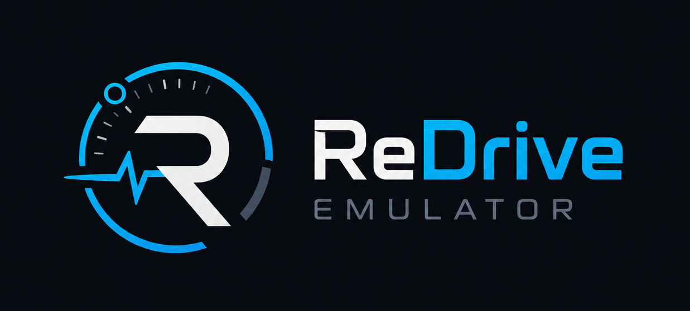
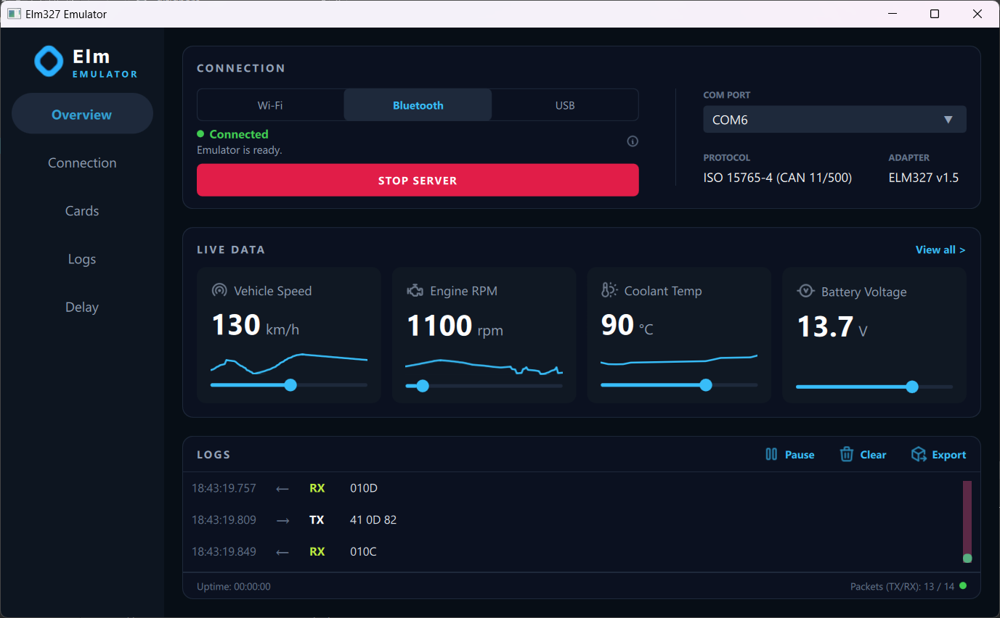

<a id="readme"></a>
<div align="center">




</div>

# ELM327 Emulator

> **ELM327 Emulator** is a lightweight open-source desktop tool for simulating ELM327 adapter responses without real vehicle hardware.

It allows developers to test OBD2 dashboards, diagnostic tools, and serial communication logic in a controlled virtual environment.

## About The Project

**ELM327 Emulator** was created to simplify development and testing of OBD2-based applications.

Instead of connecting to a real car and physical ELM327 adapter every time, the emulator provides predictable diagnostic responses through a serial interface.

The project is useful for:

- testing OBD2 dashboards;
- debugging ELM327 command handling;
- simulating vehicle telemetry;
- developing without real hardware;
- learning how ELM327 / OBD2 communication works.

## Key Features

- **ELM327 and OBD2 Command Simulation**  
  Handles common AT commands, Mode 01 requests, and supported PID discovery through `0100`.

- **Live Vehicle Data Emulation**  
  Simulates engine RPM, vehicle speed, coolant temperature, battery voltage, engine load, and throttle position.

- **Configurable Response Timing**  
  Allows separate delays for AT commands and OBD2 requests, including optional random jitter.

- **Serial Port Communication**  
  Works through COM and virtual serial ports. ( Wifi && USB connection soon )

- **Live Request and Response Logs**  
  Displays RX and TX traffic with pause, clear, auto-scroll, and export controls.

- **Qt/QML Desktop Interface**  
  Provides dedicated pages for connection management, vehicle parameter control, logs, and delay configuration.

- **Modular Architecture**  
  Separates transport, command handling, request routing, formatting, ECU state, and UI logic for easier future expansion.

## UI



## Built With

- **C++17** — core logic, command handling, ECU state, and transport layer
- **Qt 6** — application framework
- **Qt Quick / QML** — desktop user interface
- **CMake** — project configuration and build system

## Why ELM327 Emulator?

Testing OBD2 applications usually requires:

1. a car;
2. an ELM327 adapter;
3. a stable connection;
4. repeated manual testing.

**This emulator removes that dependency.**

It gives developers a simple virtual environment where they can test how their application reacts to diagnostic commands and changing vehicle data.

## Installation and Setup

To build the project, you need:

- Qt 6.5 or newer;
- CMake 3.16 or newer;
- a C++ compiler;

### 1. Clone the repository

```sh
git clone https://github.com/iUnreallx/ELM327-Emulator.git
```

### 2. Open the project

```sh
cd ELM327-Emulator
```

### 3. Build with CMake

```sh
cmake -B build
cmake --build build
```

### 4. Run the application

```sh
./build/appElm327-Emulator
```

## Repository Structure

## Repository Structure

```text
ELM327-Emulator/
├── qml/                                # Qt Quick user interface
│   ├── Main.qml                        # Main window and page navigation
│   │
│   ├── components/                     # Reusable interface components
│   │   ├── ConnectionPanel.qml         # Connection controls
│   │   ├── LogsPanel.qml               # RX/TX traffic viewer
│   │   ├── ParameterCard.qml           # Editable vehicle parameter card
│   │   ├── SidebarButton.qml           # Sidebar navigation button
│   │   ├── SparklineGraph.qml          # Parameter history graph
│   │   └── ToastNotification.qml       # Success and error notifications
│   │
│   ├── pages/                          # Application pages
│   │   ├── OverviewPage.qml            # Status and primary vehicle data
│   │   ├── ConnectionPage.qml          # Serial connection configuration
│   │   ├── CardsPage.qml               # All simulated vehicle parameters
│   │   ├── LogsPage.qml                # Full RX/TX log view
│   │   ├── DelayPage.qml               # Response delay and jitter controls
│   │   ├── DtcPage.qml                 # Reserved for DTC simulation
│   │   └── SettingsPage.qml            # Reserved for application settings
│   │
│   └── assets/                         # Fonts, icons, images, and branding
│       ├── fonts/
│       ├── connectionPanel/
│       ├── logsPanel/
│       ├── parametersCard/
│       └── sidebar/
│
├── src/
│   ├── core/                           # ELM327 emulator core
│   │   ├── ElmCore.cpp                 # Request processing coordinator
│   │   ├── ElmCore.h
│   │   ├── EcuModel.cpp                # ECU data exposed to QML
│   │   ├── EcuModel.h
│   │   ├── ConnectionManager.cpp       # Connection lifecycle management
│   │   ├── ConnectionManager.h
│   │   ├── LogManager.cpp              # RX/TX logging and export
│   │   ├── LogManager.h
│   │   ├── DelayManager.cpp            # Response delay and jitter settings
│   │   ├── DelayManager.h
│   │   │
│   │   ├── commands/                   # ELM327 and OBD2 command handlers
│   │   │   ├── AtCommandHandler.cpp
│   │   │   ├── AtCommandHandler.h
│   │   │   ├── ObdCommandHandler.cpp
│   │   │   └── ObdCommandHandler.h
│   │   │
│   │   ├── pipeline/                   # Request processing pipeline
│   │   │   ├── Preprocessor.cpp
│   │   │   ├── Preprocessor.h
│   │   │   ├── Router.cpp
│   │   │   ├── Router.h
│   │   │   ├── Formatter.cpp
│   │   │   └── Formatter.h
│   │   │
│   │   ├── state/                      # ECU and ELM327 session state
│   │   │   ├── EcuState.h
│   │   │   └── ElmConfig.h
│   │   │
│   │   └── interfaces/
│   │       └── ITransport.h            # Transport abstraction
│   │
│   └── io/
│       ├── SerialTransport.cpp          # Serial-port transport
│       └── SerialTransport.h
│
├── main.cpp                             # Application entry point
├── CMakeLists.txt                       # Build and QML module configuration
├── readme.md                            # Project documentation
├── LICENSE                              # MIT license
└── .gitignore
```

## How It Works?

The emulator receives **ELM327 / OBD2** commands through a transport interface and returns simulated responses.

The current implementation uses serial communication, while the architecture allows additional transports such as TCP/Wi-Fi to be added later.

Basic flow:

```text
OBD2 Application
        ↓
Transport Layer
        ↓
ELM327 Emulator Core
        ↓
Simulated OBD2 Response
```
## Example Commands

```text
0100    # Supported PIDs (01–20)
0104    # Calculated engine load
0105    # Coolant temperature
010C    # Engine RPM
010D    # Vehicle speed
0111    # Throttle position

ATRV    # Battery voltage
ATZ     # Reset the ELM327 session
```
## Roadmap

The full project roadmap is available in [ROADMAP.md](ROADMAP.md).


## Contributing ❤️

Contributions are welcome.

If you want to improve the emulator:

1. Fork the repository.
2. Create a new branch.

```sh
git checkout -b feature/my-amazing-elm-feature
```

3. Commit your changes.

```sh
git commit -m "Add my my-amazing-elm-feature"
```

4. Push the branch.

```sh
git push origin feature/my-amazing-elm-feature
```

5. Open a Pull Request.

## License

The project is distributed under the MIT license. See the [LICENSE](LICENSE) file for details.

## Contact

GitHub: [@iUnreallx](https://github.com/iUnreallx)

Project Link: [https://github.com/iUnreallx/ELM327-Emulator](https://github.com/iUnreallx/ELM327-Emulator)
<p align="right">(<a href="#readme">back to top</a>)</p>
